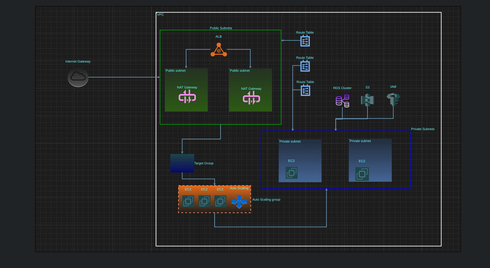

# Terraform AWS Multi-Tier Infrastructure 

Automated deployment of a **production-ready AWS environment** with high availability web application, PostgreSQL database cluster, and complete VPC networking.

[](AWS Terrraform Architecture.png)

##  What This Project Delivers

**Complete Infrastructure Stack:**


- **Custom VPC** with public/private subnets, NAT gateways, route tables
- **Application Load Balancer** with target groups and health checks  
- **Auto Scaling Group** (1-3 instances) with EC2 Launch Template
- **EC2 Instances** running nginx serving custom blue-themed webpages
- **PostgreSQL RDS** cluster (primary + read replica, custom parameters)
- **IAM + S3** with custom policies and user management
- **Security Groups** for web, load balancer, and database access

## Tech Stack

Terraform 1.2+ | AWS Provider 6.x | terraform-aws-modules/vpc 6.6.0

## Quick Start

```bash
# Clone & deploy
git clone https://github.com/ProtocS2/terraform-aws-protoc
cd terraform-aws-protoc
terraform init
terraform plan
terraform apply
```

**Connect to your app:** `terraform output lb_dns_name`

## Architecture Highlights

1. **Modular Design** - VPC via official Terraform module
2. **High Availability** - ALB + ASG + Multi-AZ RDS  
3. **Zero-Downtime** - Launch templates + rolling updates
4. **Production Patterns** - NAT gateways, private DB subnets, IAM least-privilege

## Live Demo Outputs

ALB DNS: protoc-lb-123456789.us-west-2.elb.amazonaws.com
RDS Primary: protoc.xxxxxxx.us-west-2.rds.amazonaws.com:5432
RDS User: edu | Password: S3curePass-2026!


##  Challenges Overcome
-  Resolved AWS provider v5→v6 migration conflicts
-  Fixed Terraform module output mismatches  
-  Handled RDS password validation constraints
-  Replaced problematic security group modules with manual resources

##  Repository Structure

├── main.tf # Core infrastructure
├── variables.tf # Input variables
├── terraform.tfvars # Environment values
├── outputs.tf # Queryable outputs
├── user-data.sh # Nginx bootstrap script
└── README.md


##  Skills Demonstrated
**Cloud Engineering:** VPC design, load balancing, auto-scaling, RDS clustering  
**IaC:** Terraform modules, provider versioning, state management  
**Troubleshooting:** Dependency resolution, validation errors, AWS API constraints  

---

**Built with Terraform on AWS** | **52 Resources Deployed** | **Fully Automated**

[View on GitHub](https://github.com/ProtocS2/terraform-aws-protoc) **Deploy in 10 minutes!**
